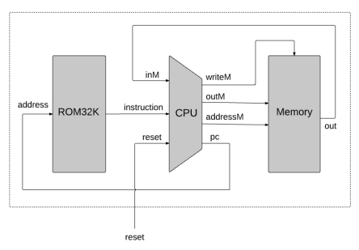
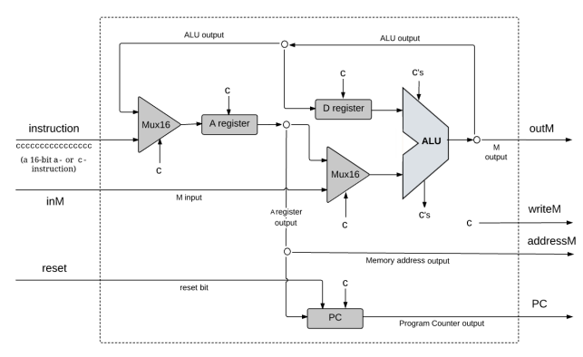
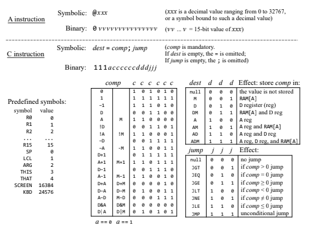

## Hack Computer

The Hack computer is constructed in the Nand2Tetris series, where we build a computer starting from the Nand gate within a simulated environment. The Hack computer is a 16-bit system that utilizes Harvard architecture, distinguishing between instruction memory (ROM) and data memory (RAM). This design achieves a simpler architecture while sharing similarities with the Von Neumann architecture commonly used in daily basis. The components include ROM, RAM, and a CPU, as illustrated in the architecture diagram.

Hack Architecture :


CPU Architecture :


This repository contains an assembler for the Hack machine language implemented in the Go programming language. The Hack language specifications are detailed in the image below:



Usage :

```$ ./hack-assembler $(input filename)```

The result will be found in `out.hack` file